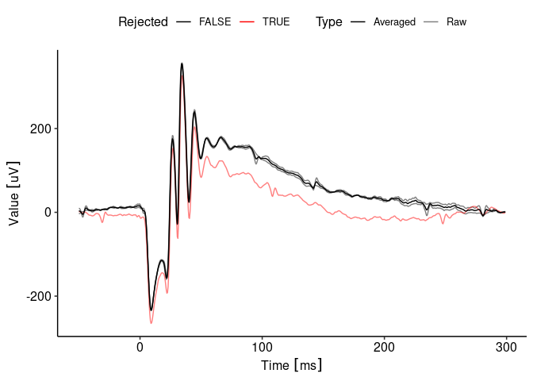
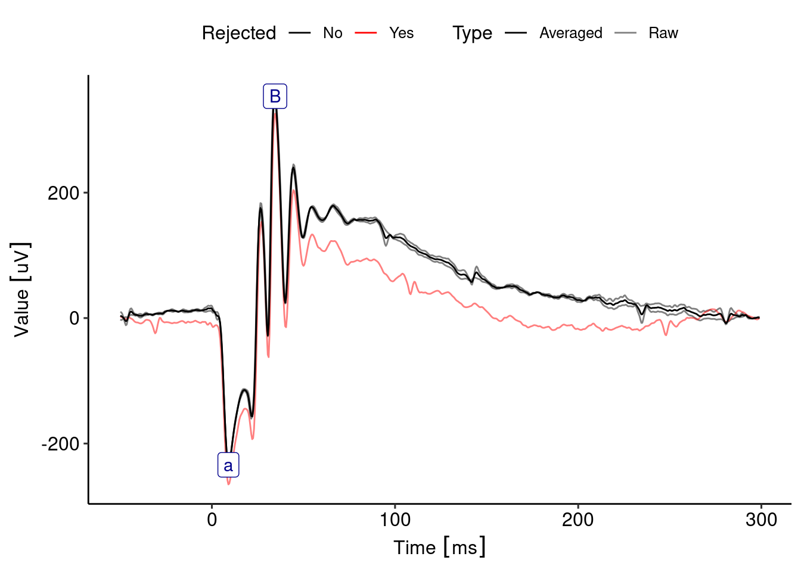

<!-- README.md is generated from README.Rmd. Please edit that file -->

# ERGtools2

<!-- badges: start -->
<!-- badges: end -->

The ERGtools2 package is an environment for working with
electroretinogram data. It contains an import method for Diagnosys
Espion data, but allows reading in of data coming in other formats with
limited coding effort. Standard procedures like averaging, sub-setting
an visualization of individual exams are supported.

## Installation

You can install the development version of ERGtools2 from
[GitHub](https://github.com/) with:

    if (!requireNamespace("remotes", quietly = TRUE)){
      install.packages("remotes")
    }
    remotes::install_github("moritzlindner/ERGtools2")

Note that `ERGtools2` depends on the github-deposited R Packages
`EPhysData` and `EPhysMethods`. Installation usually works
automatically. Updating, however may fail. If this is the case, update
manually using the following line of code:

    remotes::install_github("moritzlindner/EPhysData")
    remotes::install_github("moritzlindner/EPhysMethods")

## Example

This is a basic example which shows you how to solve a common problem:

    library(ERGtools2)

    ## a typical workflow
    data(ERG) # load example data, to import own data, see the examples provided for newERGExam and ImportEspion
    StimulusTable(ERG) # have a look whats inside
    #>   Step     Description Intensity Background  Type
    #> 1    1 DA 0 01 cd s m       0.01         DA Flash
    #> 2    2    DA 1 cd s m       1.00         DA Flash
    #> 3    3    DA 3 cd s m       3.00         DA Flash
    Metadata(ERG)
    #>    Step Channel Repeat Eye Channel_Name Recording
    #> 1     1     ERG      1  RE          ERG         1
    #> 2     1     ERG      1  LE          ERG         2
    #> 3     1      OP      1  RE           OP         3
    #> 4     1      OP      1  LE           OP         4
    #> 5     2     ERG      1  RE          ERG         5
    #> 6     2     ERG      1  LE          ERG         6
    #> 7     2      OP      1  RE           OP         7
    #> 8     2      OP      1  LE           OP         8
    #> 9     3     ERG      1  RE          ERG         9
    #> 10    3     ERG      1  LE          ERG        10
    #> 11    3      OP      1  RE           OP        11
    #> 12    3      OP      1  LE           OP        12
    ERG<-ClearMeasurements(ERG) # Clear Measuremnts that migth be alredy in object
    ERG<-SetStandardFunctions(ERG)
    ggERGTrace(ERG, where = list( Step = as.integer(3), Eye = "RE", Channel ="ERG", Repeat = as.integer(1))) # pick one and have a look at the traces as imported

    ERG <- AutoPlaceMarkers(ERG, Channel.names = pairlist(ERG = "ERG")) # automatically place markers
    #> ========================================================================================================================================================================================================================
    Measurements(ERG)
    #> ========================================================================================================================================================================================================================
    #>    Recording Step     Description Channel Repeat Eye Name Relative       Time         Voltage Channel_Name Recording.y
    #> 1          1    1 DA 0 01 cd s m      ERG      1  RE    a     <NA> 0.0315 [s]  -53.17071 [uV]          ERG           1
    #> 2          1    1 DA 0 01 cd s m      ERG      1  RE    B        a 0.0515 [s]  346.34079 [uV]          ERG           1
    #> 3          2    1 DA 0 01 cd s m      ERG      1  LE    a     <NA> 0.0310 [s]  -85.88321 [uV]          ERG           2
    #> 4          2    1 DA 0 01 cd s m      ERG      1  LE    B        a 0.0505 [s]  310.38093 [uV]          ERG           2
    #> 5          5    2    DA 1 cd s m      ERG      1  RE    a     <NA> 0.0125 [s] -206.37706 [uV]          ERG           5
    #> 6          5    2    DA 1 cd s m      ERG      1  RE    B        a 0.0355 [s]  547.86889 [uV]          ERG           5
    #> 7          6    2    DA 1 cd s m      ERG      1  LE    a     <NA> 0.0130 [s] -209.66536 [uV]          ERG           6
    #> 8          6    2    DA 1 cd s m      ERG      1  LE    B        a 0.0355 [s]  491.97428 [uV]          ERG           6
    #> 9          9    3    DA 3 cd s m      ERG      1  RE    a     <NA> 0.0090 [s] -233.89249 [uV]          ERG           9
    #> 10         9    3    DA 3 cd s m      ERG      1  RE    B        a 0.0345 [s]  587.60032 [uV]          ERG           9
    #> 11        10    3    DA 3 cd s m      ERG      1  LE    a     <NA> 0.0095 [s] -240.61577 [uV]          ERG          10
    #> 12        10    3    DA 3 cd s m      ERG      1  LE    B        a 0.0345 [s]  568.70641 [uV]          ERG          10
    ggERGTrace(ERG, where = list( Step = as.integer(3), Eye = "RE", Channel ="ERG", Repeat = as.integer(1))) # pick one and have a look at the traces as imported
    #> ========================================================================================================================================================================================================================
    #> ========================================================================================================================================================================================================================

